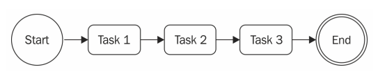
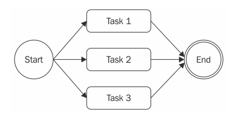
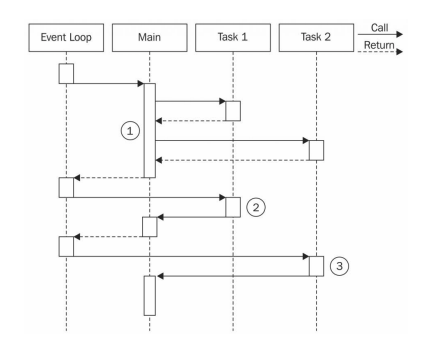
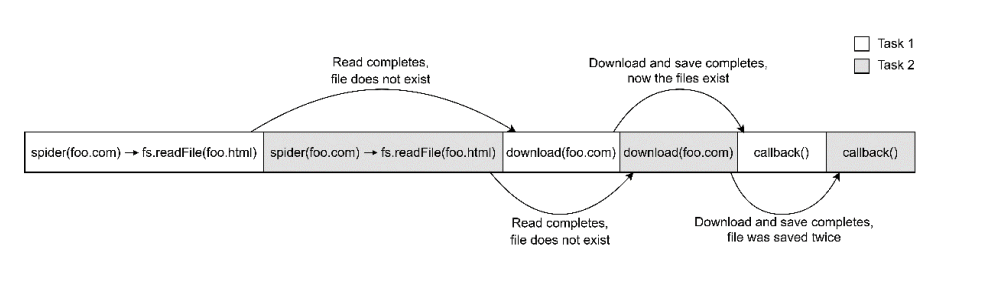
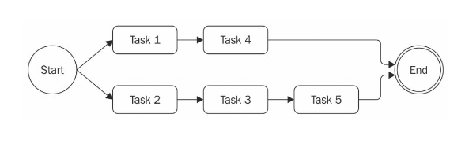

# [Node.js 디자인 패턴 바이블] Chapter 04 콜백을 사용한 비동기 제어 흐름 패턴


**이번 절에서 배울 것들**

- 비동기 프로그래밍에 대한 과제
- 콜백 지옥을 피하는 것과 콜백 모범 사례들
- 연속적 실행, 연속적 반복, 병렬 실행 그리고 제한된 병렬 실행에서 흔히 다루는 비동기 패턴


**목차**

- 4-1 비동기 프로그래밍의 어려움
  - 간단한 웹 스파이더 만들기
  - 콜백 지옥 (Callback hell)
- 4-2 콜백 모범 사례와 제어 흐름 패턴
  - 콜백 규칙
  - 콜백 규칙 적용
  - 순차 실행
  - 병렬 실행
  - 제한된 병렬 실행
- 4-3 비동기 라이브러리


## 도입

- 동기식 프로그래밍 스타일을 사용하는 플랫폼에서 Node.js와 같이 **연속 전달 스타일(CPS)**과 비동기 API를 일반적으로 사용하는 플랫폼으로의 적응은 쉽지 않을 수 있습니다.
- 비동기 코드는 구문이 실행되는 순서를 예측하기 어렵게 할 수 있습니다.
- 일련의 파일들을 반복 탐색하거나, 작업을 순서대로 실행하거나, 일련의 작업들이 완료될 때까지 기다리는 것과 같은 간단한 문제라도 비효율적이고 가독성이 떨어지는 것을 피하기 위해서 개발자에게는 새로운 접근법과 기술들이 요구됩니다.
- 비동기 제어 흐름을 다루기 위해 콜백을 사용할 때 가장 흔히 하는 실수는 콜백 지옥에 빠지거나 코드가 간단한 루틴에서조차 가독성이 떨어지고 유지하기 힘들어져서 수직적이라기보다 수평적으로 커지는 일입니다.


- 이 장에서는 몇 가지 규칙과 패턴을 사용하여 실제로 어떻게 콜백을 능숙하게 제어하며, 깔끔하게 관리 가능한 비동기 코드를 작성할 수 있는지 살펴볼 것입니다.
- 콜백을 올바르게 다루는 법을 알게 되는 것은 프라미스와 async/await와 같이 최근에 쓰이는 접근법을 사용하기 위한 초석이 될 것입니다.


## 4-1 비동기 프로그래밍의 어려움

- JS에서는 비동기 코드에 대한 제어를 놓치는 일이 정말 흔하게 일어납니다.
- 클로저와 익명 함수의 in-place 정의는 개발자가 코드베이스 지점들을 옮겨 다니지 않고 원할한 프로그래밍을 하게 해줍니다.
- 이는 **KISS(Keep It Simple, Stupid)** 원칙과 완전하게 부합합니다.
- 이는 코드가 매끄럽게 흘러가게 해주고 이를 짧은 시간에 정의할 수 있게 해줍니다.
- 불행히도 모듈화, 재사용성 그리고 유지보수성과 같은 특성들을 희생하는 것은 콜백의 중첩을 통제할 수 없이 급증하게 하고 함수의 크기가 커지며 구성 또한 엉망이 되게 합니다.
- 대부분의 경우 in-place 콜백을 만드는 것이 절대적으로 요구되는 것은 아닙니다.
- 그래서 비동기 프로그래밍과 관련된 문제보다는 규칙 문제가 더 중요합니다.
- 코드가 다루기 힘들어지는지 좋아지고 있는지를 인지하며 그것이 통제하기 힘들어지는 것을 미리 알고 그에 따라 최선의 해결책을 가지고 행동하는 것이 전문가와 초보자의 차이입니다.


### 4-1-1 간단한 웹 스파이더 만들기

- 이야기를 풀어나가기 위해서 우리는 웹 URL을 입력으로 받아 해당 URL의 내용을 로컬 파일로 다운로드하는 간단한 콘솔용 애플리케이션인 웹 스파이더를 만들어 보겠습니다.
- 이 장에서 소개될 코드에서는 몇 가지의 npm 종속성들이 사용됩니다.
  - superagent: 스트림라인 HTTP 호출 라이브러리
  - mkdirp: 재귀적으로 디렉터리를 만드는 작은 유틸리티
- 또한 우리는 애플리케이션에서 사용할 헬퍼들을 가지고 있는 `./utils.js`라는 로컬 모듈을 종종 참조할 것입니다.
  - https://github.com/PacktPublishing/Node.js-Design-Patterns-Third-Edition 참고


- 애플리케이션의 핵심 기능은 `spider.js`라는 모듈 안에 있습니다.
- 사용할 모든 종속성들을 로드하는 것으로 시작해보겠습니다.

```js
import fs from 'fs'
import path from 'path'
import superagent from 'superagent'
import mkdirp from 'mkdirp'
import { urlToFilename } from './utils.js'
```

```typescript
// utils.js
import path from 'path';
import { URL } from 'url';
import slug from 'slug';

export function urlToFilename(url) {
  const parsedUrl = new URL(url);
  const urlPath = parsedUrl.pathname
    .split('/')
    .filter(function (component) {
      return component !== '';
    })
    .map(function (component) {
      return slug(component, { remove: null });
    })
    .join('/');
  let filename = path.join(parsedUrl.hostname, urlPath);
  if (!path.extname(filename).match(/htm/)) {
    filename += '.html';
  }

  return filename;
}
```


- 다음으로 다운로드할 URL과 다운로드 프로세스가 완료될 때 호출될 콜백 함수를 취하는 `spider()`라는 새로운 함수를 만듭니다.

```js
export function spider(url, cb) {
  const filename = urlToFilename(url)
  fs.access(filename, err => {     // (1)
    if (err && err.code === 'ENOENT') {
      console.log(`Downloading ${url} into ${filename}`)
      superagent.get(url).end((err, res) => {     // (2)
        if (err) {
          cb(err)
        } else {
          mkdirp(path.dirname(filename), err => {    // (3)
            if (err) {
              cb(err)
            } else {
              fs.writeFile(filename, res.text, err => {    // (4)
                if (err) {
                  cb(err)
                } else {
                  cb(null, filename, true)
                }
              })
            }
          })
        }
      })
    } else {
      cb(null, filename, false)
    }
  })
}
```

- 여기서 많은 것들이 진행됩니다. 단계별로 좀 더 상세하게 다루어 보겠습니다.

  1. 해당하는 파일이 존재하는지 확인하여 해당 URL에서 이미 다운로드를 했는지 검사합니다. err가 정의되어있고 타입이 ENOTENT이라면 파일이 존재하지 않으므로 파일 생성에 문제가 없습니다.

  ```js
  fs.access(filename, err => ...
  ```

  2. 파일을 찾을 수 없을 경우 해당 URL은 다음의 코드를 통해 다운로드됩니다.

  ```js
  superagent.get(url).end((err, res) => ...
  ```

  3. 그 다음 파일이 저장될 디렉터리가 있는지 확인합니다.

  ```js
  mkdirp(path.dirname(filename), err => ...
  ```

  4. 마지막으로 HTTP 응답의 내용을 파일 시스템에 씁니다.

  ```js
  fs.writeFile(filename, res.text, err => ...
  ```


- 우리의 웹 스파이더 애플리케이션을 완성하기 위해서 URL을 입력으로(우리의 경우, 커맨드라인에서 인자를 읽습니다) 제공하여 `spider()` 함수만 호출하면 됩니다.
  - `spider()` 함수는 우리가 방금 정의한 파일에서 export 됩니다.
- 이제 커맨드라인에서 직접 호출될 수 있는 새로운 파일 `spider-cli.js`을 만듭니다.

```js
import { spider } from './spider.js'

spider(process.argv[2], (err, filename, downloaded) => {
  if(err) {
    console.error(err)
  } else if (downloaded) {
    console.log(`Completed the download of "${filename}"`)
  } else {
    console.log(`"${filename}" was already downloaded`)
  }
})
```


- 이제 웹 스파이더 애플리케이션을 사용할 준비가 되었습니다. 
- 먼저 utils.js 모듈과 프로젝트 디렉터리에 있는 전체 종속성 목록을 가지고 있는 package.json이 있는지 확인한 후, 다음 명령을 통해 모든 종속성을 설치합니다.

```shell
npm install
```


- 이제 웹 페이지의 내용을 다운로드하기 위해 커맨드에서 다음과 같이 `spider-cli.js` 모듈을 실행합니다.

```shell
node spider-cli.js http://www.example.com
```


- 다음 섹션에서는 이 코드의 가독성을 어떻게 향상시키고 가능한 어떻게 콜백 기반 코드를 깔끔하고 가독성 좋게 유지할 수 있는지 배워보겠습니다.


### 4-1-2 콜백 지옥 (Callback hell)

- 앞에서 정의한 `spider()` 함수를 살펴보면, 우리가 구현한 알고리즘이 정말 간단하지만 결과적으로는 코드에 여러 수준의 들여쓰기가 존재하므로 읽기가 매우 어렵다는 것을 알 수 있습니다.
- 직접 스타일의 블로킹 API로 유사한 기능을 구현하는 것이 더 간단할 수 있으며 코드의 가독성이 훨씬 더 올라갈 것이 분명합니다.
- 그러나 비동기식 CPS를 사용하는 것은 또 다른 이야기이며, in-place 콜백 정의를 잘못 사용하는 것은 좋지 않은 코드를 야기할 수 있습니다.


- 많은 클로저와 in-place 콜백 정의가 코드의 가독성을 떨어뜨리고 관리할 수 없는 덩어리로 만드는 상황을 **콜백 지옥**이라고 합니다.
- 이것은 Node.js와 JavaScript에서 일반적으로 가장 잘 알려져 있는 안티 패턴 중 하나입니다.

```js
asyncFoo(err => {
	asyncBar(err => {
		asyncFooBar(err => {
			...
		})
	})
})
```

- 이런 식으로 작성된 코드가 깊은 중첩으로 인해 피라미드 같은 모양을 취한다는 것을 볼 수 있습니다.
- 그 때문에 이것이 한편으로는 **죽음의 피라미드 (pyramid of doom)**로 알려진 이유입니다.


- 위와 같은 코드에서 가장 분명하게 드러나는 문제점은 **가독성**입니다.
  - 중첩이 너무 깊어서 함수가 어디서 끝나고 또 다른 함수는 어디서 시작하는지 추적하는 것이 거의 불가능합니다.
- 또 다른 문제는 각 스코프에서 사용되는 **변수이름의 중복**이 발생한다는 점입니다.
  - 흔히 변수의 내용을 설명하기 위해서 유사하거나 동일한 이름을 사용해야 하기 때문입니다.
  - 가장 좋은 예가 각 콜백이 수신하는 인자인 err입니다.
- 그리고 클로저가 성능 및 메모리 소비 측면에서 부정적인 영향을 미칠 수 있다는 것을 명심해야 합니다.
  - 또한 그것들은 식별하기 쉽지 않은 메모리 누수를 만들어 냅니다.
  - 실제로 활성 클로저에 의해 참조되는 컨텍스트가 가비지(garbage) 수집 시 유지된다는 것을 잊어서는 안됩니다.


- `spider()` 함수를 보면 그것이 콜백 지옥 상황을 명확히 나타내고 방금 설명한 모든 문제들을 가지고 있다는 것을 알아차릴 수 있습니다.
- 다음 섹션에서 패턴과 기술들을 가지고 고쳐보도록 하겠습니다.


## 4-2 콜백 모범 사례와 제어 흐름 패턴

- 콜백 지옥에 대한 첫 번째 예를 보았고, 이제 분명히 피해야 함을 알게 되었습니다. 
- 그러나 비동기 코드를 작성할 때 주의해야 할 사항은 그것뿐만이 아닙니다.
- 실제로 일련의 비동기 작업들의 흐름을 제어하려면 특정 패턴과 기법을 사용해야만 하는 상황이 있습니다.
- 특히 외부 라이브러리를 사용하지 않고 일반 JavaScript만 사용하는 경우에는 더욱 그렇습니다.
- 예를 들어, 순서에 따라 비동기 작업을 적용하여 컬렉션을 반복하는 것은 배열에 `forEach()`를 호출하는 것과 같이 쉬운 것이 아니며 실제로는 재귀와 유사한 기술을 필요로 합니다.


- 이 섹션에서는 콜백 지옥을 피하는 방법뿐만 아니라, 단순하고 간단한 JavaScript만 사용하여 가장 일반적인 제어 흐름 패턴을 구현하는 방법에 대해서도 배우게 될 것입니다.


### 4-2-1 콜백 규칙

- 비동기 코드를 작성할 때 명심해야 할 첫 번째 규칙은 **<u>콜백을 정의할 때 in-place 함수의 정의를 남용하지 않는 것</u>**입니다.
- 모듈화 및 재사용성과 같은 문제에 대한 추가적인 사항을 고려할 필요가 없어 매력적이겠지만, 이는 장점보다 단점이 더 많을 수 있는 방식이라는 것을 이미 앞에서 살펴보았습니다.
- 대부분의 경우 콜백 지옥 문제를 해결하기 위한 어떤 라이브러리나 멋진 기술 혹은 패러다임의 변화가 필요한 것은 아니며, 간단하고 일반적인 상식이면 충분합니다.


- 다음은 중첩수준을 낮게 유지하고 일반적으로도 코드 체계를 개선하는데 도움이 되는 몇 가지 기본 원칙입니다.
  - 가능한 빨리 종료합니다. 문맥에 따라 `return`, `continue`, `break`를 사용하면 `if ... else`문을 모두 작성(및 중첩)하는 대신 현재 구문을 즉시 종료할 수 있습니다. 이렇게 하면 얕은 수준으로 코드를 유지하는데 도움이 됩니다.
  - 콜백을 위해 명명된 함수를 생성하여 클로저 바깥에 배치하며 중간 결과를 인자로 전달합니다. 함수의 이름을 지정하면 스택 추적에서 더 잘 보이게 됩니다.
  - 코드를 모듈화 합니다. 가능하면 작고 재사용 가능한 함수들로 분할하세요.


### 4-2-2 콜백 규칙 적용

- 앞에서 언급한 아이디어들에 대한 힘을 보여주기 위해서 우리의 웹 스파이더 애플리케이션에 있는 콜백 지옥 문제를 해결하는데 적용해 봅시다.
- 첫 번째 단계로 else 문을 제거하여 오류 검사 패턴을 재구성할 수 있습니다. 이는 오류를 받는 즉시 함수로부터 복귀가 가능합니다. 
- 따라서 다음과 같은 코드를 사용하는 대신

```js
if (err) {
  cb(err)
} else {
  // 에러가 없을 때 실행할 코드
}
```

- 다음과 같은 코드를 작성하여 코드의 구성을 개선할 수 있습니다.

```js
if (err) {
  return cb(err)
}
// 에러가 없을 때 실행할 코드
```

- 이것은 종종 **빠른 반환 원칙**으로 언급됩니다. 이 간단한 트릭을 사용하여 함수의 중첩 수준을 바로 줄일 수 있습니다.
  - 이 방법은 아주 쉬우며, 복잡한 리팩토링을 요구하지 않습니다.


- spider() 함수의 두 번째 최적화로 재사용 가능한 코드의 구분을 시도할 수 있습니다. 예를 들어, 파일에 문자열을 쓰는 기능은 다음과 같이 별도의 함수로 쉽게 분리할 수 있습니다.

```js
function saveFile(filename, contents, cb) {
  mkdirp(path.dirname(filename), err => {
    if(err) {
      return cb(err);
    }
    fs.writeFile(filename, contents, cb)
  })
}
```

- 동일한 원칙에 따라 URL과 파일 이름을 입력으로 사용하여 URL에서 주어진 파일을 다운로드하는 `download()`라는 일반 함수를 만들 수 있습니다. 내부적으로 앞서 만든 `saveFile()` 함수를 사용할 수 있습니다.

```js
function download(url, filename, cb) {
  console.log(`Downloading ${url} into ${filename}`);
  superagent.get(url).end((err, res) => {
    if (err) {
      return cb(err);
    }

    saveFile(filename, res.text, err => {
      if (err) {
        return cb(err);
      }

      console.log(`Downloaded and saved: ${url}`)
      cb(null, filename, true);
    });
  });
}
```

- 마지막 단계로 `spider()` 함수를 수정합니다. 변경 사항을 적용하면 `spider()` 함수는 이제 다음과 같은 형태가 됩니다.

```js
export function spider(url, cb) {
  const filename = urlToFilename(url);
  fs.access(filename, err => {
    if (!err || err.code !== 'ENOENT') {
      return cb(null, filename, false);
    }

    download(url, filename, err => {
      if (err) {
        return cb(err);
      }
      cb(null, filename, true);
    })
  });
}
```

- `spider()` 함수의 기능 및 인터페이스는 완전히 똑같습니다. 코드가 구성된 방식만 바뀌었습니다.
- 알아보아야 할 한 가지 중요한 세부 사항은 우리가 앞서 언급한 빠른 반환 원칙이 적용될 수 있도록 파일의 존재 유무에 대한 검사의 순서를 뒤바꾸었다는 것입니다.
- 빠른 반환 원칙과 다른 콜백 규칙들을 적용함으로써 코드의 중첩을 크게 줄일 수 있었으며, 동시에 재사용성 및 테스트 가능성을 높일 수 있었습니다. 
- 사실 우리는 `saveFile()`과 `download()`를 모두 익스포트하여 다른 모듈에서 재사용하도록 할 수 있습니다.
  - 또한 이것은 우리로 하여금 그것들의 기능을 독립적으로 테스트할 수 있게 합니다.

- 이 섹션에서 수행한 리팩토링은 대부분의 경우 클로저와 익명함수를 남용하지 않도록 하는데 필요한 몇 가지 원칙만을 사용했을 뿐이었습니다.
- 외부 라이브러리르 사용하지 않고 최소한의 노력만으로 훌륭히 작동하는 코드를 만들었습니다.
- 이제 콜백을 사용하여 어떻게 비동기 코드를 깔끔하게 작성하는지 알게 되었습니다. 
- 이로써 우리는 순차적 그리고 병렬적 실행과 같은 몇 가지 가장 일반적인 비동기 패턴을 알아볼 준비가 되었습니다.


### 4-2-3 순차 실행

- 이 섹션에서는 비동기 제어 흐름 패턴을 살펴보고 순차 실행 흐름을 분석해 보겠습니다.
- 일련의 작업을 순차적으로 실행한다는 것은 한 번에 하나씩 실행한다는 것을 의미합니다.
- 목록상의 작업 결과가 다음 작업의 실행에 영향을 줄 수 있으므로 실행 순서가 중요하고 이를 보존해야 합니다.
- 다음 그림은 이 개념을 설명합니다.




- 이 흐름에는 다양한 변형이 있습니다.
  - 데이터의 전파 없이 일련의 작업을 순서대로 실행합니다.
  - 작업의 출력을 다음 작업의 입력으로 사용합니다. (체인, 파이프라인 또는 폭포수라고도 함).
  - 순차적으로 각 요소에 대해 비동기 작업을 실행하면서 일련의 작업들을 반복합니다.
- 순차 실행은 직접 방식의 블로킹 API를 사용하여 구현할 때에는 비교적 간단하지만 일반적으로 비동기 CPS를 사용하여 구현할 경우 콜백 지옥의 주요 원인이 됩니다.


**알려진 일련의 작업을 순차적으로 실행하기**

- 이미 이전 섹션에서 `spider()` 함수를 구현하면서 순차 실행에 대해 보았다.
- 우리가 살펴본 간단한 규칙들을 적용하여 순차적 실행 흐름에서 알려진 일련의 작업을 구성할 수 있었다.
- 이 코드를 지침으로 삼아 다음의 패턴으로 솔루션을 일반화할 수 있다.

```js
function task1(cb) {
  asyncOperation(() => {
    task2(cb)
  })
}

function task2(cb) {
  asyncOperation(() => {
    task3(cb)
  })
}

function task3(cb) {
  asyncOperation(() => {
    cb() // 결과적으로 콜백을 실행
  })
}

task1(() => {
  // task1, task2, task3가 완료되었을 때 실행된다.
  console.log('tasks 1, 2 and 3 executed')
})
```

- 앞의 패턴은 일반적인 비동기 작업 완료 시, 각 작업이 다음 작업을 호출하는 방법을 보여줍니다.
- 이 패턴은 작업의 모듈화에 중점을 두어 비동기 코드를 처리하는데 항상 클로저를 사용할 필요가 없다는 것을 보여줍니다.


**순차 반복**

- 앞에서 설명한 패턴은 실행될 작업의 수와 양을 미리 알고 있을 경우 완벽하게 작동합니다.
  - 이렇게 하면 시퀀스의 다음 작업 호출을 하드코딩할 수 있습니다. 
- 그러나 컬렉션의 각 항목에 대해 비동기 작업을 실행하고 싶다면 어떻게 될까요?
  - 이와 같은 경우에는 더 이상 작업 순서를 하드코딩할 수 없습니다.
  - 대신 동적으로 구축해야 합니다.


**패턴**

- 컬렉션의 요소들이나 일반적인 작업 목록에 대해 비동기 순차적으로 반복해야 하는 상황에 사용할 수 있는 패턴에 대해 알아보자.


**인자가 없는 경우**

```js
function finish() {
  // 반복 완료
}

function iterate(index) {
	if(index === tasks.length) {
    return finish();
  }
  const task = tasks[index];
  task(() => iterate(index+1))
}

iterate(0);
```


**인자가 있는 경우**

```js
const tasks = [task1, task2, task3];

function task1(arg: number, cb: (arg: number) => void) {
  setTimeout(() => {
    const res = arg + 5;
    console.log('task1 result:', res);
    cb(res);
  }, 600);
}

function task2(arg: number, cb: (arg: number) => void) {
  setTimeout(() => {
    const res = arg * 2;
    console.log('task2 result:', res);
    cb(res);
  }, 600);
}

function task3(arg: number, cb: (arg: number) => void) {
  setTimeout(() => {
    const res = arg - 2;
    console.log('task3 result:', res);
    cb(res);
  }, 600);
}

function iterate(arg: number, index: number) {
  if (index === tasks.length) {
    console.log('tasks completed');
    return;
  }

  const task = tasks[index];
  task(arg, res => {
    iterate(res, index + 1);
  });
}

iterate(30, 0);
```


- 방금 소개된 패턴은 여러 가지 상황에 적용할 수 있기 때문에 매우 강력합니다. 몇 가지 예를 간단히 언급해보겠습니다.
  - 배열의 값들을 비동기적으로 매핑할 수 있다.
  - 반복문에서 연산의 결과를 다음 반복에 전달하여 reduce 알고리즘을 구현할 수 있다.
  - 특정 조건이 충족되면 루프를 조기에 중단할 수 있다.(`Array.some()` 헬퍼의 비동기적 구현).
  - 무한한 요소에 대한 반복이 가능.


- 또한 다음과 같은 형태의 함수로 감싸서 솔루션을 더욱 일반화할 수도 있다.

```js
iterateSeries(collection, iteratorCallback, finalCallback)
```

- `collection`: 실제 반복하려는 데이터 셋입니다. 
- `iteratorCallback`: 각 아이템 별로 실행시킬 함수
- `finalCallback`: 모든 아이템이 실행을 마치거나 에러인 경우 실행되는 함수
- 이 헬퍼 함수의 구현은 여러분의 몫으로 남겨두겠습니다.


> **순차 반복 패턴**
>
> iterator라는 함수를 작성하여 작업의 목록을 실행하십시오. iterator는 컬렉션에서 다음에 사용 가능한 작업을 호출하고 현재 작업이 완료될 때 반복의 다음 단계를 호출하도록 합니다.


- 다음 섹션에서는 병렬 실행 패턴에 대해서 알아보겠습니다. 이것은 다양한 작업들의 순서가 중요치 않을 때 더욱 편리합니다.


### 4-2-4 병렬 실행

- 일련의 비동기 작업들의 실행 순서가 중요하지 않고 단지 이런 작업들의 모든 실행이 끝났을 때 알림을 받으면 되는 경우가 있습니다.
- 이러한 상황은 다음 그림과 같은 병렬 실행 흐름을 사용하여 보다 효과적으로 처리할 수 있습니다.



- Node.js가 단일 스레드라는 것을 생각하면 이상하게 들릴 수 있지만, "1장. Node.js 플랫폼"에서 설명한 내용을 기억한다면, Node.js의 논 블로킹 성질 덕분에 단 하나의 스레드만 가지고도 동시성을 달성할 수 있다는 것을 알 수 있을 것입니다. 
- 실제로 이 경우 병렬이라는 용어는 부적절합니다.
- 작업들을 동시에 실행하는 것이 아니라 논 블로킹 API 위에서 실행되고 이벤트 루프에 의해 interleave(교차로 배치하다)된다는 것을 의미하기 때문입니다.


- 여러분도 알다시피, 작업이 새로운 비동기 작업을 요청할 때, 이벤트 루프가 새로운 작업을 실행할 수 있도록 제어를 이벤트 루프로 돌려줍니다.
- 이러한 종류의 흐름에 적절한 용어는 동시성이지만, 일단 단순하게 표현하기 위해 병렬이라는 용어를 사용하겠습니다.


- 다음의 다이어그램은 Node.js 프로그램에서 두 개의 비동기 작업을 병렬로 실행하는 방식을 보여줍니다.



- 위의 그림에서 두 개의 비동기 작업을 실행하는 main 함수가 있습니다.
  1. Main 함수는 Task1과 Task2를 실행시킵니다. 이와 같이 비동기 작업이 시작되면 즉시 컨트롤을 Main 함수로 되돌려 주며, Main 함수는 이를 이벤트 루프로 반환합니다.
  2. 작업1의 비동기 작업이 완료되면 이벤트 루프가 제어를 작업1에 돌려줍니다. 작업1이 작업을 완료하면 Main 함수에 이를 통지합니다. 이때 작업1의 자체적인 내부 작업 수행은 동기적입니다.
  3. 작업2에 의해 시작된 비동기 작업이 완료되면 이벤트 루프가 해당 콜백을 호출하며 다시 제어를 작업2에 되돌려줍니다. 작업2가 끝나면 Main 함수에 다시 통지됩니다. 이 시점에서 Main 함수는 작업1과 작업2가 모두 완료되었음을 인지하고 있으므로 자신의 실행을 계속하거나 작업 결과를 다른 콜백으로 반환할 수 있습니다.

- 간단히 말하자면 Node.js에서는 논 블로킹 API에 의해 내부적으로 동시 처리되기 때문에 병렬 비동기 작업으로 실행된다는 것입니다.
- Node.js에서 동기(블로킹) 작업은 실행을 비동기 작업에 끼워 넣거나 `setTimeout()` 또는 `setImmediate()`로 지연시키지 않는 한, 동시에 실행할 수 없습니다.
- 이에 대해서는 "11장. 고급 레시피"에서 자세히 설명합니다.


**패턴**

```js
const tasks = [ /* ... */ ]

let completed = 0
tasks.forEach(task => {
  task(() => {
    if(++completed === tasks.length) {
      finish();
    }
  })
})

function finish() {
  // 모든 작업이 완료됨
}
```

- 적은 수정으로도 우리는 패턴이 각 작업의 결과를 컬렉션에 모으거나, 배열의 요소를 필터링 또는 매핑하거나, 일정한 작업의 수가 완료되면 즉시 finish() 콜백을 호출하도록 할 수 있습니다.
- 특히, 이 마지막 상황을 **경쟁(competitive race)**이라고 부릅니다.


> **무한 병렬 실행 패턴**
>
> 한 번에 모든 항목을 생성하여 일련의 비동기 작업들을 병렬로 실행한 다음, 콜백이 호출된 횟수를 계산하여 모든 작업이 완료되기를 기다립니다.

- 병렬에서 다중 작업이 실행되고 있을 때, 외부 리소스(예를 들어, 파일이나 데이터베이스의 레코드)에 대한 접근에 대한 경쟁, 즉, 경쟁 상태(race conditions)를 가질 수 있습니다.
- 다음 섹션에서는 Node.js에서의 경쟁 상태에 대해 얘기해보고 그것들을 확인하고 해결하기 위한 몇 가지 기술들을 알아보겠습니다.


**동시 작업과 경쟁 상태 수정**

- 멀티 스레드와 함께 블로킹 I/O를 사용하는 경우 병렬로 작업들을 실행할 때 문제가 발생할 수 있습니다.
- 그러나 Node.js에서 이것은 완전히 다른 이야기입니다.
- 실제로 여러 개의 비동기 작업을 병렬로 실행하는 것은 리소스 측면에서 직관적이며 비용이 적게 듭니다.


- 이것은 Node.js의 가장 중요한 강점 중 하나입니다.
- 엄격하게 필요한 경우에만 사용하는 복잡한 기술보다는 병렬화를 일반적인 방식으로 사용하기 때문입니다.

 

- Node.js가 가진 동시성 모델의 또 다른 중요한 특징은 작업 동기화 및 경쟁 상태를 다루는 방식입니다.
- 다중 스레드 프로그래밍에서 이것은 일반적으로 락, 뮤텍스, 세마포어 및 모니터와 같은 구조를 사용하여 수행되며, 병렬화의 성능에 상당한 영향을 미칠 뿐만 아니라 가장 복잡한 측면 중 하나일 수 있습니다.
- Node.js에서는 모든 것이 단일 스레드에서 실행되기 때문에 일반적으로 멋진 동기화 메커니즘을 필요로 하지 않습니다.
- 그러나 이것이 우리가 경쟁 조건을 가지지 않는다는 것을 의미하지 않으며, 오히려 아주 일반적일 수 있습니다.
- 문제의 근본적인 원인은 비동기 작업 호출과 그 결과에 대한 통지 사이에 생기는 지연입니다.


- 구체적인 예를 보기 위해서, 우리의 웹 스파이 애플리케이션을 다시 언급할 것입니다. 특히 우리가 만든 마지막 버전은 실제로 경쟁 상태를 가지고 있습니다.
- `spider()` 함수에서 경쟁 상태가 존재하는 부분은 해당 URL을 다운로드하기 전에 파일이 이미 존재하는지 확인하는 부분입니다.

```js
export function spider(url, nesting, cb) {
  const filename = urlToFilename(url)
  fs.readFile(filename, 'utf8', (err, fileContent) => {
    if(err) {
      if(err.code !== 'ENOENT') {
        return cb(err);
      }
      
      return download(url, filename, (err, requestContent) => {
        // ...
```


- 문제는 동일한 URL에 대한 두 spider 작업은 다른 하나가 다운로드를 완료하고 파일을 생성하기 전에 같은 파일에 대한 `fs.readFile()`을 호출한다는 것입니다. 
- 이것이 두 작업에 대하여 다운로드를 하게끔 합니다.



- 위 그림은 Task1과 Task2가 Node.js의 단일 스레드에서 인터리브(교차배치)되는 방법과 비동기 작업이 실제로 경쟁 상태를 발생시킬 수 있다는 것을 보여줍니다.
- 이 경우 두 spider 작업이 같은 파일을 다운로드하게 됩니다.


- 어떻게 고칠 수 있을까요?
- 대답은 생각보다 훨씬 간단합니다. 사실 우리가 필요로 하는 것은 동일한 URL에서 실행되는 여러 `spider()` 작업을 상호 배제할 수 있는 변수입니다. 다음과 같은 코드를 사용하면 이 작업을 수행할 수 있습니다.

```js
const spidering = new Set()
function spider(url, nesting, cb) {
  if(spidering.has(url)) {
    return process.nextTick(cb);
  }
  spidering.add(url)
  
  // ...
}
```

- 주어진 url이 spidering set에 이미 존재하면 함수를 즉시 종료합니다. 
- 그렇지 않을 경우 url을 spidering에 더해주고 다운로드를 계속합니다.
- 이 경우 spider 작업이 완전히 다른 시점에 실행되더라도 URL을 다시 다운로드하지 않을 것이기 때문에 잠금을 해제할 필요가 없습니다.
- 만약 당신이 수백 수천 개의 웹페이지를 다운로드해야 하는 spider를 구축한다면 파일이 다운로드되었을 때 set에서 다운로드된 url을 지움으로써 메모리 소비의 무한한 증가로부터 set의 길이를 유지하는데 도움이 될 것입니다.


- 경쟁 상태는 단일 스레드 환경에 있어서도 많은 문제를 일으킬 수 있습니다.
- 경우에 따라서는 데이터 손상으로 이어질 수 있으며 일시적인 특성으로 인해 디버그하기 매우 어렵습니다.
- 따라서 병렬로 작업을 실행할 때에는 이러한 유형을 명확하게 확인하는 것이 좋습니다.


- 또한 정해지지 않은 병렬 작업의 수는 매우 위험할 수 있습니다.
- 다음 섹션에서는 이것이 왜 위험하고 병렬 작업의 수를 어떻게 제어할 수 있는지 알아보겠습니다.


### 4-2-5 제한된 병렬 실행

- 제어되지 않는 병렬 작업들의 생성은 종종 과부하를 일으킬 수 있습니다.
  - 수천 개의 파일을 읽거나, URL에 접근하거나 또는 DB에 대한 쿼리를 병렬로 실행한다고 가정해봅시다.
  - 이러한 상황에서 흔히 발생하는 문제는 리소스의 부족입니다.
  - 가장 일반적인 예는 애플리케이션이 한 번에 너무 많은 파일을 열려고 할 경우, 프로세스에서 가능한 모든 파일 기술자를 써버리는 것입니다.
- 유저의 요청을 다루기 위해 무한한 병렬 작업을 생성하는 서버는 DoS(Denial-of-Service) 공격에 취약할 수 있습니다.
  - 이것은 악의적인 사용자가 하나 이상의 요청을 서버에 보냄으로써 서버가 리소스를 소비하게 하고 응답을 불가능하게 할 수 있습니다.
  - 일반적으로 병렬 작업의 수를 제한하는 것이 복원력 있는 애플리케이션을 만드는데 도움이 되는 사례입니다.
- 우리의 웹 스파이더 버전 3은 병렬 작업의 수를 제한하지 않습니다. 따라서 작동하지 못하게 될 많은 경우에서 취약함을 가집니다.
  - 예를 들어, 엄청나게 방대한 웹사이트에 대해서 우리의 애플리케이션을 실행할 경우 몇 초도 안되어 ECONNREFUSED 에러 코드와 함께 동작하지 않는 것을 보게 될 것입니다.
  - 우리가 동시적으로 너무 많은 페이지를 다운로드할 때, 서버는 같은 IP에 대해서 새로운 커넥션을 거부하기 시작합니다. 
  - 이 경우에 우리의 스파이더는 충돌이 나며 웹 사이트를 계속해서 크롤링하기를 원한다면 강제로 프로세스를 다시 재시작해야 합니다.
  - 우리가 충돌로부터 ECONNREFUSED를 다룰 수 있는 방법은 프로세스를 멈추는 것이지만 너무 많은 병렬 작업을 할당하는 것은 여전히 위험하며 다른 문제를 일으킬 수도 있습니다.
- 이 섹션에서는 동시성을 제한하여 어떻게 우리의 스파이더를 좀 더 회복력있게 만들 수 있는지 보겠습니다.


- 다음의 다이어그램은 5개의 작업이 동시성 2개로 제한되어 병렬적으로 실행되는 상황을 보여줍니다.



- 위 그림은 우리의 알고리즘이 어떻게 작동하는지를 명확하게 보여줍니다.
  1. 처음에는 동시 실행의 제한을 초과하지 않게 최대한 많은 작업을 생성합니다.
  2. 그런 다음 작업이 완료될 때마다 한도에 도달하지 않도록 하나 또는 하나 이상의 작업을 만듭니다.


**동시성 제한 패턴**

- 이제 제한된 동시성과 함께 주어진 일련의 작업들을 병렬로 실행하기 위한 패턴을 살펴보겠습니다.

```js
const tasks = [
  // ...
]

const concurrency = 2;
let running = 0;
let completed = 0;
let index = 0;

function finish() {
  // 모든 작업이 끝남
}

function next() {  // (1)
  while (running < concurrency && index < tasks.length) {
    const task = tasks[index++];
    task(() => {
      if(++completed === tasks.length) {
        return finish();
      }
      running--;
      next();
    })
   	running++
  }
}
next()

```

- 이 알고리즘은 순차 실행과 병렬 실행의 혼합으로 생각될 수 있습니다.
  1. `next()`라는 반복 함수가 있으며, 동시성 제한 내에서 가능한 많은 작업을 병렬로 생성하는 내부 루프가 있습니다.
  2. 다음으로 중요한 부분은 우리가 각 작업에 넘겨주는 콜백입니다. 콜백은 리스트에 모든 작업을 완료했는지 검사합니다. 실행할 작업이 있으면 `next()`를 호출하여 다른 작업을 생성합니다.


**전역적인 동시성 제한**

- 우리의 웹 스파이더 애플리케이션은 일련의 작업에 대한 동시성 제한에서 배운 것을 적용하기에 완벽합니다.
- 실제로 수 천 개의 링크가 동시에 크롤링 되는 상황을 피하기 위해 동시 다운로드 수에 대한 예측 가능성을 추가하여 이 프로세스의 동시성에 대한 제한을 강제할 수 있습니다.


- 우리는 동시성 제한 패턴의 구현을 `spiderLinks()` 함수에 적용할 수 있으나 그것은 주어진 페이지 내에서 발견된 링크들에 대한 동시 작업을 제한할 뿐입니다.
  - 예를 들어, 동시 실행의 수를 2로 정한다면 각 페이지에 대해 최대 두 개의 링크를 병렬로 다운로드할 수 잇게 됩니다.
  - 그러나 한 번에 여러 개의 링크를 다운로드할 수 있게 되면 각 페이지에서 또 다른 두 개의 다운로드가 생성되어 다운로드 작업의 총계가 기하급수적으로 늘어납니다.


- 일반적으로 제한된 동시성 패턴의 구현은 우리가 실행하기 위해 결정해 놓은 일련의 작업들이 있거나 시간이 지나면서 작업의 수가 선형적으로 증가할 때 잘 작동합니다.
  - 그러나 우리의 웹 스파이더에서처럼 하나의 작업이 두 개 또는 그 이상의 작업들을 직접적으로 생성해 낼 때에는 전역의 동시성을 제한한 구현은 적합하지 않습니다.


**큐를 사용한 해결**

- 우리가 정말 원하는 것은 동시에 실행할 수 있는 다운로드 작업의 전체 수를 제한하는 것입니다.
- 우리는 이전 섹션에서 사용했던 패턴을 약간 수정할 수 있겠지만 그것은 여러분을 위한 연습으로 남겨두겠습니다.
- 대신, 여러 작업에 대한 동시성을 제한하기 위해 **큐(Queue)**를 사용하는 또 다른 메커니즘을 소개하고자 합니다.


- 우리는 TaskQueue라는 간단한 클래스를 구현할 것입니다.
  - TasksQueue는 앞에서 소개된 알고리즘과 큐를 결합한 것입니다.
  - taskQueue.js라는 이름으로 새로운 모듈을 만들어보겠습니다.

```js
export class TaskQueue {
  constructor(concurrency) {
    this.concurrency = concurrency
    this.running = 0
    this.queue = []
  }
  
  pushTask(task) {
    this.queue.push(task);
    process.nextTick(this.next.bind(this));
    return this;
  }
  
  next() {
    while(this.running < this.concurrency && this.queue.length) {
      const task = this.queue.shift();
      task(() => {
        this.running--;
        process.nextTick(this.next.bind(this));
      });
      this.running++;
    }
  }
}
```

- 이 클래스의 생성자는 동시성 제한만을 입력으로 받고 그 외 인스턴스 변수인 `running`과 `queue`를 초기화합니다.
  - `running` 변수는 실행 중인 모든 작업을 추적하는데 사용되는 카운터이며,
  - `queue`는 보류 중인 작업들을 저장하는 큐로 사용될 배열입니다.
- `pushTask()` 메서드는 단순히 새 작업을 큐에 추가한 다음, 비동기적으로 `this.next()`를 호출하여 작업을 로드합니다.
  - `next` 함수가 `process.nextTick`에 의해 호출될 때 컨텍스트를 잃어버릴 것이기 때문에 `bind`를 사용한 점에 주목하세요
- `next()` 메서드는 동시성 제한을 초과하지 않도록 큐로부터 일련의 작업을 만들어 냅니다.
  - 이 메서드는 앞서 소개된 동시성 제한 섹션에 있는 패턴과 몇 가지 유사점이 있음을 알 수 있습니다.
  - 기본적으로 동시 제한을 초과하지 않는 한 가능한 많은 작업을 큐로부터 시작합니다.
  - 각 작업이 완료됐을 때 실행 중인 작업의 수를 갱신하고 비동기적으로 `next()`를 다시 호출하여 다른 작업을 시작합니다.
- TaskQueue에서 흥미로운 점은 새 작업을 큐에 동적으로 추가할 수 있다는 것입니다.
- 다른 장점으로 이제는 작업들의 동시 실행 제한에 대한 엔티티를 중앙에서 가지고 함수 실행의 모든 인스턴스에서 공유할 수 있다는 것입니다.
- 우리의 경우에는 잠시 후에 보게 될 `spider()` 함수입니다.


**TaskQueue 다듬기**

- 앞에서 구현한 TaskQueue가 큐 패턴을 보여주기에 충분하지만 실제 프로젝트에 사용되기 위해서는 몇 가지 특성이 더 필요합니다. 
  - 작업 중에 하나가 실패했을 때 어떻게 판단할 수 있을까요?
  - 큐에 있는 모든 작업이 완료되었는지 아닌지 어떻게 알 수 있을까요?
- "3장. 콜백과 이벤트"에서 살펴보았던 몇 가지 개념을 가져오며 작업 실패를 전파하거나 큐가 비었을 때 관찰자에게 알리기 위해 이벤트를 발생시킬 수 있도록 TaskQueue가 EventEmitter를 상속받겠습니다.


- 우리가 해야 할 첫 번째 수정은 EventEmitter를 임포트하고 TaskQueue를 그것으로 extend하는 것입니다.

```js
export class TaskQueue extends EventEmitter {
  private concurrency: number;
  private running: number;
  private queue: any[];

  constructor(concurrency: number) {
    super();
    this.concurrency = concurrency;
    this.running = 0;
    this.queue = [];
  }

  pushTask(task) {
    this.queue.push(task);
    process.nextTick(this.next.bind(this));
    return this;
  }

  next() {
    if (this.running === 0 && this.queue.length === 0) {
      return this.emit('empty');
    }

    while (this.running < this.concurrency && this.queue.length > 0) {
      const task = this.queue.shift();
      task(err => {
        if (err) {
          this.emit('error', err);
        }
        this.running--;
        process.nextTick(this.next.bind(this));
      });
      this.running++;
    }
  }
}

function task1(cb) {
  setTimeout(() => {
    console.log('task1 completed');
    cb();
  }, 700);
}

function task2(cb) {
  setTimeout(() => {
    console.log('task2 completed');
    cb();
  }, 700);
}

function task3(cb) {
  setTimeout(() => {
    cb(new Error('task3 error'));
  }, 700);
}

function task4(cb) {
  setTimeout(() => {
    console.log('task4 completed');
    cb();
  }, 700);
}

const tq = new TaskQueue(2);
tq.pushTask(task1)
  .pushTask(task2)
  .pushTask(task3)
  .pushTask(task4)
  .addListener('error', err => {
    console.log('error occured:', err);
  })
  .addListener('empty', () => {
    console.log('all tasks completed');
  });

```

- 이전에 구현한 것과 비교해보면 두 가지가 추가되었습니다.
  - `next()` 함수가 호출될 때마다, 실행 중인 작업이 없고 큐가 비어있는지 아닌지 검사합니다. 이 경우는 큐가 모두 소진되었고 empty 이벤트를 발생시킬 수 있습니다.
  - 이제 각 작업마다 콜백의 완료는 error를 전달받아 호출될 수 있습니다. 에러가 실제로 전달되었는지 아닌지 검사하여 작업이 실패하였는지 나타낼 수 있으며 error 이벤트로 에러를 전파합니다.


- 에러가 발생한 경우 큐의 동작을 의도적으로 유지합니다. 
  - 진행 중인 다른 작업을 정지하거나 대기 중인 작업을 삭제하지 않습니다.
  - 이것은 큐 기반 시스템에서 꽤 흔한 일입니다.
  - 시스템이 충돌하도록 두는 것보다는 에러의 발생을 예상한 뒤 에러를 밝히고 재시도나 복구 전략을 생각하는 것이 낫습니다.	
  - "13장. 메시징과 통합 패턴"에서 이 개념들을 좀 더 다뤄보겠습니다.


## 4-3 비동기 라이브러리 

- 지금까지 분석한 모든 제어 흐름 패턴을 잠깐 살펴본다면, 재사용 가능하고 보다 일반적인 솔루션을 구축하기 위한 기반으로 사용될 수 있음을 알 수 있을 것입니다.
  - 예를 들어, 작업 목록을 받아들이는 함수를 무제한 병렬 실행 알고리즘으로 만든 후에 모든 작업이 완료되면 주어진 콜백을 호출하도록 할 수 있습니다.
  - 제어 흐름 알고리즘을 재사용 가능한 함수로 만드는 이 방법은 비동기 제어 흐름을 정의하는데 보다 선언적이고, 표현적인 방식으로 이어질 수 있으며, 정확하게 async(https://caolan.github.io/async/v3/)가 하는 방식이 바로 그것입니다
- async 라이브러리는 Node.js와 JS에서 일반적으로 사용되는 비동기 코드 처리 솔루션입니다.
  - 다양한 환경에서 작업들의 실행을 크게 단순화하는 일련의 함수들을 제공하며, 컬렉션을 비동기적으로 처리할 수 있는 유용한 헬퍼들을 제공합니다.
  - 비록 같은 목표를 갖는 다른 라이브러리들이 있지만 async는 꾸준한 인기로 인해 Node.js에서 사실상 표준입니다.
  - 특히, 비동기 작업들을 정의하기 위한 콜백을 사용할 때 그렇습니다.
- 몇 가지 가장 중요한 async 모듈의 중요 능력들에 대한 아이디어를 보여드리겠습니다. 그것이 제공하는 기능들에 대한 간략한 소개가 여기 있습니다.
  - 요소들의 컬렉션 위에서 비동기 함수들을 실행시킵니다 (순차적 또는 제한적 동시성과 함께 병렬적으로).
  - 모든 함수의 출력이 다음 함수의 입력이 되는 비동기 함수 체인(waterfall) 실행 
  - TaskQueue와 함께 구현했던 것과 기능적으로 동등한 큐 추상화를 제공
  - race(첫 번째 작업이 완료됐을 때 다수의 비동기 함수를 병렬적으로 실행하거나 정지)와 같은 흥미로운 비동기 패턴들을 제공합니다.

